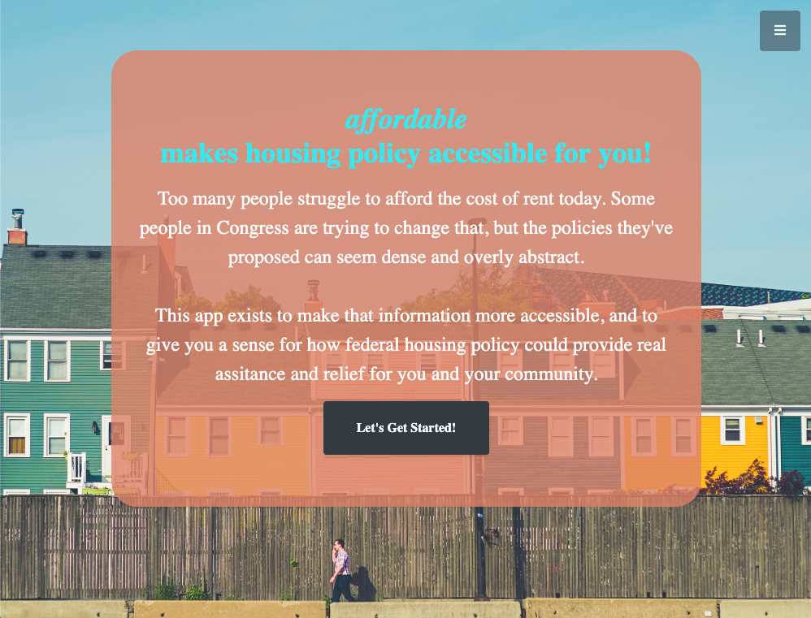

# AFFORDABLE

AFFORDABLE is a responsive React/Redux SPA created by [Andrew A Johnson](https://andrewjohnson.dev) to help make affordable housing policy more accessible.

## Preview

[]

**[Development Video Demo](http://bit.ly/2Q30l4M)**

## About

Too many people struggle to afford the cost of rent today. Some people in Congress are trying to change that, but the policies they've proposed can seem dense and overly abstract.

This app exists to make that information more accessible, and to give you a sense for how federal housing policy could provide real assistance and relief for you and your community.

The app asks users for some very basic information about where they live and the price of rent, then queries Census Bureau and Dept of HUD APIs for information on area median incomes and fair market rent evaluations. With that data available, we're able to provide insightful estimates on how currently proposed federal housing policies might stand to assist individuals with the cost of housing in very real ways.

## Contact

Please feel free to [contact me by email](mailto:ajohnson.uva@gmail.com) to provide feedback or reach out about available web development positions and opportunities.
